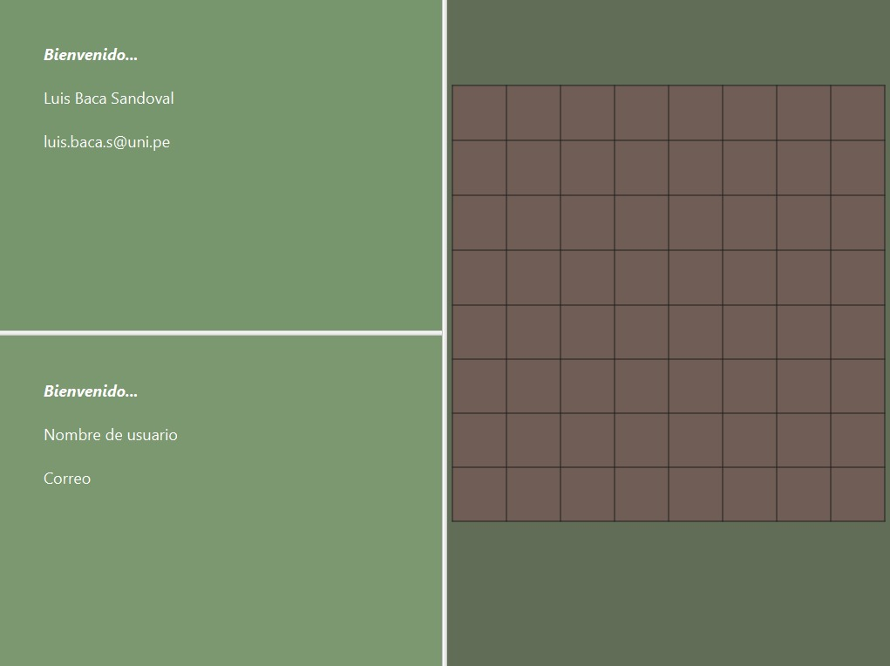

# Damas Inglesas en Linea - Sprint 1

¡Bienvenido a la aplicación de Damas Inglesas! Regístrate para guardar tus partidas y sigue tu progreso a lo largo del tiempo. Desafía a la computadora o a un amigo en emocionantes partidas de uno contra uno. ¡Descubre quién tiene la mejor estrategia y habilidades para coronarse como el campeón de las damas!

## Historias de usuario implementadas

- 002 Como usuario existente, necesito iniciar sesión para acceder al sistema.
- 004 Como usuario logueado, necesito visualizar mi información personal para poder identificar mi cuenta.
- 007 Como jugador, necesito un tablero de 8x8 para poder jugar.
- 010 Como jugador que desea jugar contra otra persona, necesito encontrar un oponente para poder iniciar el juego.
- 011 Como jugador, necesito 12 fichas del mismo color para poder jugar

## Estructura del proyecto

### Código de producción
    ->main.java.org.example.sprintOne
	|
	->database (contiene las clases para la conexión y manipulación de bases de datos)
	|	->ConecctionBD
    |   ->RequestUser
	|
	->englishdraughts (contiene las clases que implementan la lógica del juego de damas)
	|	->User
	|	->Piece
	|	->Board
	|	->Game
	|
    ->guicontroller (contiene los controladores de los archivos FXML para la interfaz gráfica de usuario)
	|	->HomeController
	|	->HomeLoginController
	|
	->interaction (contiene las clases para la comunicación con otros jugadores)
	|	->Client
	|	->Server
	|
	->others (contiene clases adicionales para diversas funcionalidades)
		->Alert
		->PasswordEncryption
### Código de test

    ->test.java.org.example.sprintOne

## ¿Cómo usar Damas Inglesas en Linea?

Inicia sesión, recuerda iniciar sesión con tu correo UNI y tu contraseña debe contener 8 números.

Al ingresar se mostrará tu información y buscará un adversario de manera automatica, también se mostrará el tablero vacío.

## Enlaces
Diseño de la Interfaz Gráfica: [Figma](https://www.figma.com/file/oyr1ETp0ox2mi2joxj76XD/Damas-Americanas?type=design&node-id=0-1&mode=design&t=jdEKVgzLTlriDhA8-0)

Enlace Sprint 1: [Sprint 1](https://docs.google.com/document/d/1J4eUTV7wDOrLEDDubRVQ8W7uxTKxuHfs/edit)

Informe de Estado Inicial: [Informe](https://docs.google.com/document/d/1jNWqpodPY4oK1j_nxgunKu_II731s1Sb/edit)