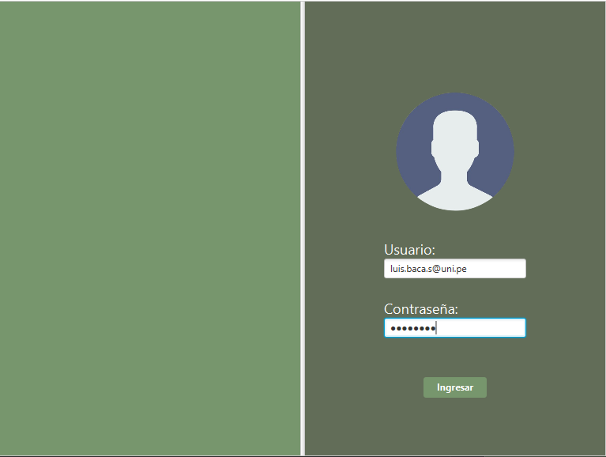
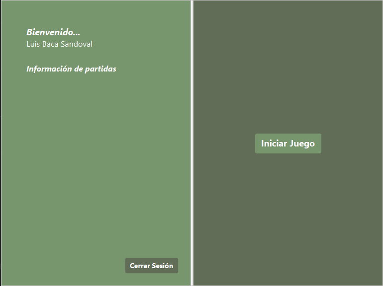
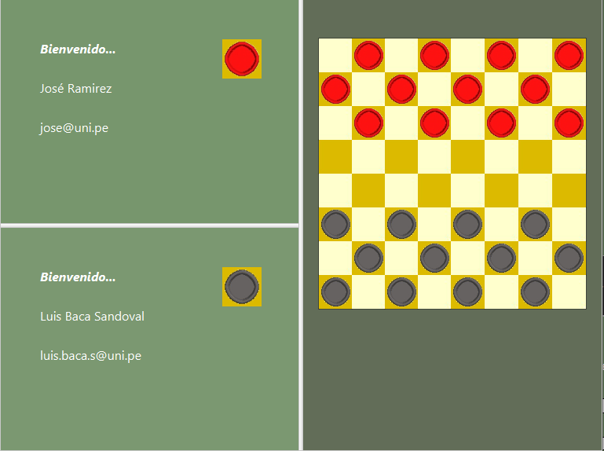
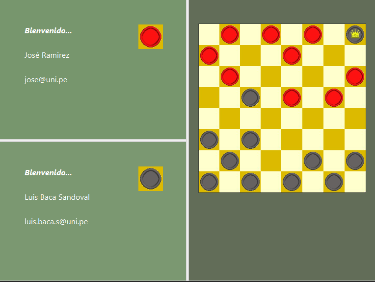
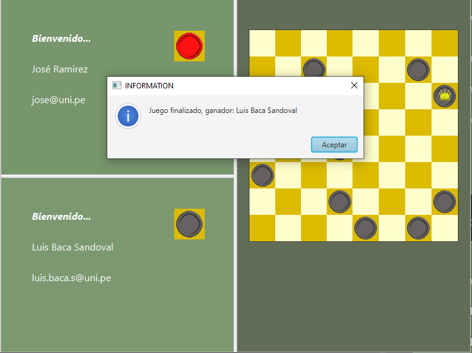

# Damas Inglesas en Linea - Sprint 3

¡Bienvenido a la aplicación de Damas Inglesas! Regístrate para guardar tus partidas y sigue tu progreso a lo largo del tiempo. Desafía a la computadora o a un amigo en emocionantes partidas de uno contra uno. ¡Descubre quién tiene la mejor estrategia y habilidades para coronarse como el campeón de las damas!

## Historias de usuario implementadas

- 002 Como usuario existente, necesito iniciar sesión para acceder al sistema.
- 003 Como usuario logueado, necesito cerrar sesión para proteger mi privacidad y seguridad.
- 004 Como usuario logueado, necesito visualizar mi información personal para poder identificar mi cuenta.
- 007 Como jugador, necesito un tablero de 8x8 para poder jugar.
- 010 Como jugador que desea jugar contra otra persona, necesito encontrar un oponente para poder iniciar el juego.
- 011 Como jugador, necesito 12 fichas del mismo color para poder jugar
- 012 Como jugador, necesito poder mover mis fichas solo en diagonales hacia adelante en el tablero para seguir las reglas del juego.
- 013 Como jugador, necesito tener la capacidad de capturar las fichas de mi oponente saltando sobre ellas.
- 014 Como jugador, necesito la opción de coronar mis fichas si llegan al extremo opuesto del tablero para convertirlas en “damas” y aumentar su poder de movimiento.
- 015 Como jugador, necesito poder mover mis “damas” tanto hacia adelante como hacia atrás en el tablero para aprovechar al máximo su potencial.
- 016 Como jugador, necesito saber cuando una partida termina para poder reconocer el ganador.
## Estructura del proyecto

### Código de producción
    ->main.java.org.example.sprintOne
	|
	->database (contiene las clases para la conexión y manipulación de bases de datos)
	|   ->ConecctionBD
    |   ->RequestUser
    |   ->SesionUser
	|
	->englishdraughts (contiene las clases que implementan la lógica del juego de damas)
	|   ->User
    |   ->Player
	|   ->Piece
	|   ->Board
	|   ->Game
	|
    ->guicontroller (contiene los controladores de los archivos FXML para la interfaz gráfica de usuario)
	|   ->HomeController
    |   ->HomeInformationController
	|   ->HomeLoginController
	|
	->interaction (contiene las clases para la comunicación con otros jugadores)
	|   ->Client
	|   ->Server
	|
	->others (contiene clases adicionales para diversas funcionalidades)
        ->Alert
        ->PasswordEncryption
### Código de test

    ->test.java.org.example.sprintOne
    |
    ->database
    |   ->ConnectionBDTest
    |   ->SesionUserTest
    |
	->englishdraughts (contiene las clases que implementan los test de la lógica del juego de damas)
	|	->UserTest
    |   ->PlayerTest
	|	->PieceTest
	|	->BoardTest
	|	->GameTest
    ->others
    |   ->PasswordEncryptionTest

## ¿Cómo usar Damas Inglesas en Linea?

Inicia sesión, recuerda iniciar sesión con tu correo UNI y tu contraseña debe contener 8 números.

Al ingresar se visualizará el home, también un botón "Iniciar Juego" para poder jugar.

Al clickear el botón buscará al oponente y nos habilitará el tablero.

Para comenzar a jugar clickear la ficha y hacia donde quieres hacer el movimiento.

Cuando no queden fichas de algún color se declarará fin del juego.

## Enlaces

[Sprint 3](https://docs.google.com/document/d/1SLW9YOMDVCKHCpDPHcyNEHk3Z2xcZ4-b/edit)