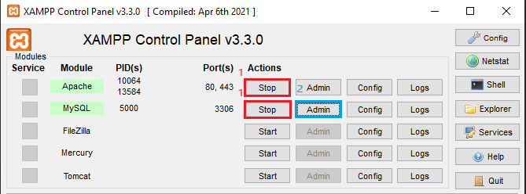
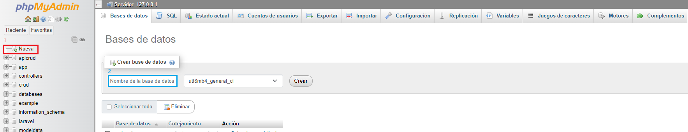
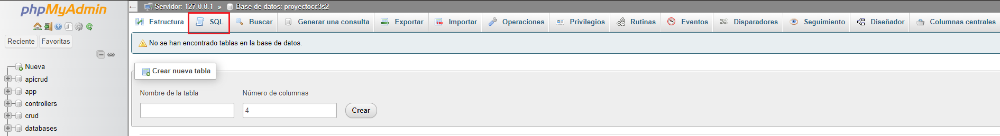

# Damas Inglesas en Linea - Sprint 3

¡Bienvenido a la aplicación de Damas Inglesas! Regístrate para guardar tus partidas y sigue tu progreso a lo largo del tiempo. Desafía a la computadora o a un amigo en emocionantes partidas de uno contra uno. ¡Descubre quién tiene la mejor estrategia y habilidades para coronarse como el campeón de las damas!

## Historias de usuario implementadas

- 002 Como usuario existente, necesito iniciar sesión para acceder al sistema.
- 003 Como usuario logueado, necesito cerrar sesión para proteger mi privacidad y seguridad.
- 004 Como usuario logueado, necesito visualizar mi información personal para poder identificar mi cuenta.
- 007 Como jugador, necesito un tablero de 8x8 para poder jugar.
- 010 Como jugador que desea jugar contra otra persona, necesito encontrar un oponente para poder iniciar el juego.
- 011 Como jugador, necesito 12 fichas del mismo color para poder jugar
- 012 Como jugador, necesito poder mover mis fichas solo en diagonales hacia adelante en el tablero para seguir las reglas del juego.
- 013 Como jugador, necesito tener la capacidad de capturar las fichas de mi oponente saltando sobre ellas.
- 014 Como jugador, necesito la opción de coronar mis fichas si llegan al extremo opuesto del tablero para convertirlas en “damas” y aumentar su poder de movimiento.
- 015 Como jugador, necesito poder mover mis “damas” tanto hacia adelante como hacia atrás en el tablero para aprovechar al máximo su potencial.
- 016 Como jugador, necesito saber cuando una partida termina para poder reconocer el ganador.
## Estructura del proyecto

### Código de producción
    ->main.java.org.example.sprintOne
	|
	->database (contiene las clases para la conexión y manipulación de bases de datos)
	|   ->ConecctionBD
    |   ->RequestUser
    |   ->SesionUser
	|
	->englishdraughts (contiene las clases que implementan la lógica del juego de damas)
	|   ->User
    |   ->Player
	|   ->Piece
	|   ->Board
	|   ->Game
	|
    ->guicontroller (contiene los controladores de los archivos FXML para la interfaz gráfica de usuario)
	|   ->HomeController
    |   ->HomeInformationController
	|   ->HomeLoginController
	|
	->interaction (contiene las clases para la comunicación con otros jugadores)
	|   ->Client
	|   ->Server
	|
	->others (contiene clases adicionales para diversas funcionalidades)
        ->Alert
        ->PasswordEncryption
### Código de test

    ->test.java.org.example.sprintOne
    |
    ->database
    |   ->ConnectionBDTest
    |   ->SesionUserTest
    |
	->englishdraughts (contiene las clases que implementan los test de la lógica del juego de damas)
	|	->UserTest
    |   ->PlayerTest
	|	->PieceTest
	|	->BoardTest
	|	->GameTest
    ->others
    |   ->PasswordEncryptionTest

## ¿Cómo usar Damas Inglesas en Linea?

Inicia sesión, recuerda iniciar sesión con tu correo UNI y tu contraseña debe contener 8 números.


Al ingresar se visualizará el home, también un botón "Iniciar Juego" para poder jugar.


Al clickear el botón buscará al oponente y nos habilitará el tablero.


Para comenzar a jugar clickear la ficha y hacia donde quieres hacer el movimiento.


Cuando no queden fichas de algún color se declarará fin del juego.


## ¡IMPORTANTE!

Para participar en partidas de Damas Inglesas, se requiere la presencia de dos dispositivos para la interacción jugador-jugador,
siendo un requisito obligatorio. Además, se sugiere la implementación de un sistema de persistencia mediante MySQL para almacenar y
gestionar los datos de manera óptima.

### Configuración de ambos dispositivos:

#### Primer dispositivo

No es requerido realizar ninguna configuración en el dispositivo primario si se opta por no implementar el sistema de persistencia.

#### Segundo dispositivo

1. Dirigete a la clase `HomeLoginController` dentro de la carpeta `guicontroller` del código de producción

Las líneas 47 y 71:

`47 SesionUser.setUsuarioActual(new User(1, "Example1","example1@uni.pe"));`

`71 controller.initServer();`

Substituir la línea 47 con la siguiente y comentar o eliminar la línea 71 debido a que no se requiere instanciar otro servidor.

`47 SesionUser.setUsuarioActual(new User(2, "Example2","example2@uni.pe"));`

2. Por último dirigete a la clase `Client` dentro de la carpeta `interaction` del código de producción

En a línea 25:

`25 Socket socket = new Socket("localhost", 8000);`

Reemplaza "localhost" por la dirección iPv4 del primer dispositivo.

### Configuración del sistema de persistencia:

>1. Instala XAMPP, puedes descargarlo de:[XAMPP](https://www.apachefriends.org/es/index.html)

>2. Presiona `Start` luego el botón de `Admin` de MySQL.



>3. Se abrirá una ventana en tu navegador y nos dirigimos a `Nueva` para crear una Base de datos.
    Agregamos el nombre "proyectocc3s2" y presionamos `Crear`.



>4. Dirigete hacia SQL, copia el código siguiente y presiona `Continuar`.


```sql
CREATE TABLE usuarios (
   id INT PRIMARY KEY AUTO_INCREMENT,
   username VARCHAR(250) NOT NULL,
   email VARCHAR(250) NOT NULL,
   password VARCHAR(250) NOT NULL
);
CREATE TABLE partidas (
id INT PRIMARY KEY AUTO_INCREMENT,
fecha DATETIME NOT NULL,
jugador1_id INT,
jugador2_id INT,
ganador_id INT,
FOREIGN KEY (jugador1_id) REFERENCES usuarios(id),
FOREIGN KEY (jugador2_id) REFERENCES usuarios(id),
FOREIGN KEY (ganador_id) REFERENCES usuarios(id)
);
INSERT INTO usuarios (username, email, password) VALUES ('Example1', 'example1@uni.pe', 'ef797c8118f02dfb649607dd5d3f8c7623048c9c063d532cc95c5ed7a898a64f');
INSERT INTO usuarios (username, email, password) VALUES ('Example2', 'example2@uni.pe', 'ef797c8118f02dfb649607dd5d3f8c7623048c9c063d532cc95c5ed7a898a64f');
INSERT INTO usuarios (username, email, password) VALUES ('Luis Jhonatan', 'luis.baca.s@uni.pe', 'ef797c8118f02dfb649607dd5d3f8c7623048c9c063d532cc95c5ed7a898a64f');
INSERT INTO usuarios (username, email, password) VALUES ('Jose Eduardo', 'jose@uni.pe', 'ef797c8118f02dfb649607dd5d3f8c7623048c9c063d532cc95c5ed7a898a64f');
```

>5. Finalmente puedes ingresar al juego con los siguientes usuarios, todos con contraseña 12345678:
- example1@uni.pe
- example1@uni.pe
- luis.baca.s@uni.pe
- jose@uni.pe

Nota: Para disfrutar del juego no es imperativo implementar el sistema de persistencia. Se ha ajustado el código para eliminar esta necesidad.

Sin embargo, será indispensable contar con dos dispositivos y configurarlos como se mencionó anteriormente. Además, asegúrate de estar conectado a la misma red."

## Enlaces

[Micro Carta](https://docs.google.com/document/d/1tbvT4GIgyrEIkrK0AWzixg5fMYJPoqmTBbkzST-zx4M/edit)

[Enlace Sprint 1](https://docs.google.com/document/d/1J4eUTV7wDOrLEDDubRVQ8W7uxTKxuHfs/edit)

[Enlace Sprint 2](https://docs.google.com/document/d/1bHAlzOnbjDAZKKcpnJ_M1PmTwqFVrzi9/edit)

[Enlace Sprint 3](https://docs.google.com/document/d/1SLW9YOMDVCKHCpDPHcyNEHk3Z2xcZ4-b/edit)

[Diseño de la Interfaz Gráfica](https://www.figma.com/file/oyr1ETp0ox2mi2joxj76XD/Damas-Americanas?type=design&node-id=0-1&mode=design&t=jdEKVgzLTlriDhA8-0)

[Informe de Estado Inicial](https://docs.google.com/document/d/1jNWqpodPY4oK1j_nxgunKu_II731s1Sb/edit)

[Video demostrativo](https://drive.google.com/drive/folders/1dmJlkkFlEN9Mnjk8CeZNdQsKk9zy0de2?hl=es)

[Presentación](https://docs.google.com/presentation/d/1-Rv7aF4_f74yqmggdnAXRWe6y7rmF7KucUs1v4dOp7o/edit#slide=id.g2d051d102dd_0_25)